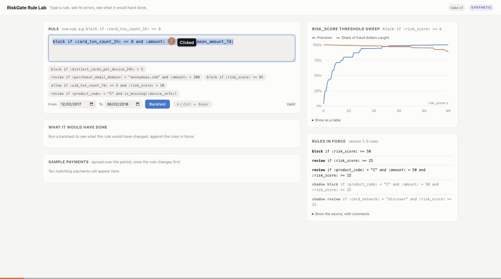

# RiskGate: Real-Time Fraud Rules Engine

RiskGate is a fraud rules engine in Go that sits in a payment's critical path and answers allow, block, or review. Analysts write rules in a small typed language with error messages meant for people who are not programmers, and a backtester replays 590K real e-commerce transactions to show what a rule would have caught and what it would have cost before it goes live. A gradient-boosted model, evaluated natively in Go, feeds the rules a calibrated `risk_score`. It does not make the decision.

The design is in [DESIGN.md](DESIGN.md). It starts with what the data can and cannot say.

## Results

Measured on the IEEE-CIS data (real, anonymized Vesta e-commerce transactions) with a time split. Each row links to the experiment that produced it.

| What | Result | Where |
|---|---|---|
| Fraud recall at 1% FPR, raw columns → raw plus velocity features (test month, touched once) | **14.8% → 16.8%**; fraud-dollar recall at a 1% legit-dollar budget **15.6% → 20.5%**; ROC-AUC 0.7745 → 0.8105 | [Experiment 1](DESIGN.md#1-what-the-streaming-features-are-worth) |
| Train/serve parity: all 590,540 payments replayed through the HTTP service, features, model inputs and scores against the offline pipeline | **0 mismatches**, bit for bit | [Experiment 2](DESIGN.md#2-trainserve-parity) |
| Go evaluator against LightGBM `predict(raw_score=True)`, 954 trees | **92,427 / 92,427** test rows bit-identical | [Experiment 2](DESIGN.md#2-trainserve-parity) |
| Closure and vectorized evaluators on generated rules | **10,000 rules × 590,540 rows, 0 disagreements** | [Experiment 3](DESIGN.md#3-two-evaluators-one-answer) |
| Velocity state shootout: bucketed ring and sketch against exact, validation month, model not retrained | Bucketed ring ROC-AUC 0.84505 → 0.84500, nothing measurable. Sketch costs 0.0024 ROC-AUC after fixing a first-seen bug the shootout found (0.0137 before) | [Experiment 4](DESIGN.md#4-velocity-state-shootout) |
| A naive last-30-days backtest against a 60-day maturity window (**simulated** dispute delays) | Fraud dollars understated by 80% to 88% naive, 4% to 6% matured | [Experiment 7](DESIGN.md#7-label-delay-simulated) |
| Highest rate with p99 inside the deadline | Not yet quotable: the only run was on a heavily loaded machine. `scripts/experiments/exp5.sh` re-runs it | [Experiment 5](DESIGN.md#5-latency-under-load) |
| Backtest of one proposed rule against the cached rule set, 590K rows | 0.58 ms (loaded machine; re-run before quoting) | [Experiment 6](DESIGN.md#6-backtest-speed) |
| RiskGate killed mid-stream (Clearinghouse client, 200/s, 50 ms deadline) | Payments fail open for the outage plus the breaker's 2 s cool-down; restart from snapshot ready in 383 ms; client max latency 57 ms | [Experiment 9](DESIGN.md#9-the-risk-service-fails) |
| Simulated dispute losses through Clearinghouse, test month, no checks → model plus rules | **$535,658 → $472,391 (−11.8%)**, net +$22,908 after $40,359 of legitimate revenue blocked; assumed $15 fee | [Experiment 8](DESIGN.md#8-end-to-end-through-clearinghouse) |

The gain from velocity features is real and modest, and the absolute numbers are well below competition scores because the model sees only the fields a rule author can name. [Experiment 1](DESIGN.md#1-what-the-streaming-features-are-worth) explains why.

RiskGate does not compare itself with Stripe Radar or with the Kaggle leaderboard. Neither comparison would be fair or meaningful. The claim is the ablation in experiment 1 and the correctness results in experiments 2 and 3.

## Demo



Recorded on the SYNTHETIC dataset (the page's badge says so), because IEEE-CIS rows may not be republished. The typo gets a caret and a suggestion. The corrected card-testing rule then gets a plain-English backtest that says it would block 12,429 legitimate payments to catch 96 frauds. That is the point of the page: a bad rule is visible as bad before it goes live.

## A rule, and what RiskGate says about it

```
allow  if :purchaser_email_domain: in @trusted_domains
block  if :card_txn_count_1h: >= 8 and :amount: > 3 * :card_mean_amount_7d:
block  if :risk_score: >= 85
review if :distinct_cards_per_device_24h: > 3
review if :product_code: = "C" and is_missing(:device_info:)
```

Evaluation follows the order Stripe documents for Radar. Allow rules run first and win, then block, then review. A mistake gets an error with a caret and a suggestion.

```
error at line 1, column 10:
block if :card_txn_cnt_1h: >= 8
         ^^^^^^^^^^^^^^^^^
unknown attribute :card_txn_cnt_1h:. Did you mean :card_txn_count_1h:?
```

## Quickstart, on synthetic data

This runs without a Kaggle account. `cmd/synth` writes a seeded dataset in the IEEE-CIS file format, and `cmd/export`, `riskgate table` and the service label everything built from it `SYNTHETIC`. **Numbers from synthetic data are about the code, never about payments.**

Requires Go 1.26 and, for training, Python 3.12. There is no one-command start, because the service needs a trained model and training is a separate offline step. The first three steps take a few minutes on a laptop. Training takes longer (a four-point LightGBM grid for two models plus logistic regression, on about 400,000 rows) and has not been timed on a quiet machine, so expect minutes, not seconds.

```sh
make synth                                        # 590,540 synthetic rows into data/synth (SYNTH_ARGS="-rows 20000" for a small run)
make export EXPORT_ARGS="-synthetic"              # features via the Go engine into data/export_synthetic

python3 -m venv .venv && .venv/bin/pip install -r python/requirements.txt
make train TRAIN_ARGS="--export data/export_synthetic --source synthetic --out models/synthetic --results data/results_synthetic"

make table TABLE_ARGS="-synthetic -model models/synthetic"   # scored backtest table, data/cache/table_synthetic.rgt
```

`--results` matters. Its default is `results/`, which holds the committed IEEE-CIS results, and synthetic numbers do not belong there.

Run the service. It refuses to start without a webhook signing secret, even if no webhook will arrive, because an empty HMAC key would accept forged disputes.

```sh
export RISKGATE_WEBHOOK_SECRETS=whsec_$(openssl rand -hex 16)
go run ./cmd/riskgate serve -model models/synthetic -table data/cache/table_synthetic.rgt
# http://127.0.0.1:8080/ is the rule page. POST /v1/assess takes one line of data/export_synthetic/test_replay.jsonl
head -1 data/export_synthetic/test_replay.jsonl | curl -s -X POST --data-binary @- http://127.0.0.1:8080/v1/assess
```

It serves `rules/default.rules` with `rules/lists.json`, keeps exact velocity state, and writes its snapshot, decision log and rule history under `var/` (gitignored). Every flag also reads from `RISKGATE_<FLAG>`, and `go run ./cmd/riskgate serve -h` lists them. Without `-model` it still runs, but `risk_score` is missing to every rule, so the default rules allow everything.

Rules and backtests, from the command line.

```sh
# check a rule file the way the service will before swapping it in
go run ./cmd/rulecheck -lists rules/lists.json rules/default.rules

# backtest one rule. -table synthetic generates a table in memory, or pass a .rgt file
go run ./cmd/backtest run -table data/cache/table_synthetic.rgt -lists rules/lists.json \
  -rule 'block if :purchaser_email_domain: in @disposable_domains and :amount: > 300'

# the risk_score threshold sweep (needs a table built with -model), and the two-evaluator differential test
go run ./cmd/backtest sweep -table data/cache/table_synthetic.rgt
go run ./cmd/backtest difftest -rules 5000 -table synthetic
```

`go run ./cmd/backtest` with no arguments lists its subcommands (`run`, `sweep`, `difftest`, `labeldelay`, `rulestats`, `flag`, `bench`, `synth`), and each takes `-h`.

## Using the real data

The IEEE-CIS data belongs to the competition and may be used for non-commercial research and education. It may not be redistributed, so this repo never contains it or anything row-level derived from it (see [Data license](DESIGN.md#data-license)). `data/`, `models/` and `var/` are gitignored. Get the data yourself.

1. Sign in to Kaggle and accept the rules at https://www.kaggle.com/competitions/ieee-fraud-detection/rules. Downloads are refused until you do.
2. Install the Kaggle CLI (`pip install kaggle`) and create an API token under Kaggle **Settings > API**. Save it as `~/.kaggle/access_token` (Kaggle CLI 2.x) or set `KAGGLE_API_TOKEN`. The legacy `~/.kaggle/kaggle.json`, or `KAGGLE_USERNAME` and `KAGGLE_KEY`, also work. Keep token files `chmod 600`.
3. Download, export, train, and score the test month once.

```sh
scripts/fetch_data.sh                             # train_transaction.csv and train_identity.csv into data/raw
make export                                       # first run builds data/cache/ieee.rgc, then writes data/export_real
go run ./cmd/backtest flag -table data/export_real/features.table -rules rules/baseline.rules \
  -out data/rules_predictions.csv                 # the rules-alone baseline, scored by the Go engine
make train TRAIN_ARGS="--export data/export_real --source ieee-cis --out models/mine --results results/mine \
  --rules-predictions data/rules_predictions.csv"
.venv/bin/python python/evaluate.py --export data/export_real --model-dir models/mine --results results/mine \
  --rules-predictions data/rules_predictions.csv  # the test month, once. It writes a lock and refuses a second look
make table TABLE_ARGS="-model models/mine"        # data/cache/table.rgt, for the service and backtests
go run ./cmd/riskgate serve -model models/mine -table data/cache/table.rgt   # with RISKGATE_WEBHOOK_SECRETS set, as above
```

Use a fresh `--results` directory. `results/ieee` holds the committed run, and its lock file makes `evaluate.py` refuse to score the test month again there.

Train/serve parity. `scripts/experiments/exp2.sh` runs all of experiment 2 (model parity on the test month, all 590,540 payments through the HTTP service, and `riskgate audit`) with `MODEL` and `EXPORT` overridable. The model half alone is two commands.

```sh
.venv/bin/python python/parity.py --export data/export_real --model-dir models/mine --out data/parity_scores.csv
go run ./cmd/parity -model models/mine -export data/export_real/export.csv -scores data/parity_scores.csv
```

Row-level outputs (per-row scores, replay files, decision logs) go under `data/` or `var/`, never `results/`.

## Repository layout

```
cmd/
  synth/        synthetic IEEE-CIS-shaped dataset
  export/       offline feature export, the same feature code the service runs
  parity/       Go model scores against LightGBM on every row
  rulecheck/    validate a rule file, errors with carets
  riskgate/     the service (serve), the backtest table builder (table), decision-log replay (audit)
  backtest/     backtests, the threshold sweep, experiments 3, 6 and 7
  serveparity/  experiment 2's replay through HTTP and its bit-for-bit comparison
  experiments/state/  experiment 4, the velocity state shootout
  loadgen/      open-loop load generator for experiment 5 (docs/LOADGEN.md)
internal/
  schema/       the field catalog shared by features, rules, model and backtester
  data/         loader, (DT, ID) ordering, month split, cache, replay format
  features/     feature engine, velocity state (exact, bucketed, sketch), snapshots
  model/        LightGBM text-model evaluator, calibration, Saabas reasons
  rules/        lexer, Pratt parser, checker, linter, closure compiler, generator
  backtest/     columnar table, vectorized evaluator, reports, sweep, label delay
  webhook/      Clearinghouse signature verifier, dedupe, event handler
  loadgen/      load generator internals
  service/      /v1/assess, rule hot swap, shadow rules, decision log, snapshots, metrics, the page
python/         offline training, baselines, evaluation, parity, fixtures
scripts/        data download, fuzzing, signature-vector checks, experiments/ (exp 2 and 5)
rules/          default.rules (the service's tuned set), baseline.rules, model_only.rules, lists.json
results/        aggregate results of every experiment run, with provenance
docs/           load generator notes, interview preparation
```

## Testing

```sh
make test        # every test
make race        # every test under the race detector (CI's race job)
make cover       # every test with a coverage report, without -race (CI's cover job)
make lint        # go vet and staticcheck
make fuzz        # every native fuzz target, FUZZTIME each (default 20s)
make bench       # Go benchmarks
```

No test needs the Kaggle data. Tests run on generated data and committed fixtures, and the few that can use real data read it only when an environment variable points at it (`RISKGATE_LEAKAGE_DATA`, `RISKGATE_BENCH_MODEL`). CI also checks gofmt and `go mod tidy`.

What the tests are there to prove.

- **Point in time.** `TestLeakage` rewrites everything after a sampled payment, reshuffles the input, replays it, and requires that payment's features to be bit-identical. It runs against all three velocity states. [More](DESIGN.md#the-leakage-test)
- **Two evaluators, one answer.** `TestDifferential` checks the closure evaluator against the vectorized one on generated, well-typed rules over tables seeded with adversarial values. [More](DESIGN.md#two-evaluators-and-the-differential-test)
- **Model parity.** `TestParityWithLightGBM` requires bit-identical raw scores on fixtures that probe every split threshold, one ulp either side, signed zeros, LightGBM's zero threshold, NaN and infinities. `cmd/parity` does the same on real data. [More](DESIGN.md#the-go-evaluator)
- **Parser fuzzing.** `FuzzParse` checks no panics, a print and parse round trip, and agreement with a reference interpreter. Bugs it found are in [internal/rules/BUGLOG.md](internal/rules/BUGLOG.md).
- **Error messages.** 35 golden files under `internal/rules/testdata/errors`.
- **Webhook signatures.** Shared vectors with Clearinghouse's Ruby verifier, and CI re-checks RiskGate's vectors against an independent Python and `openssl` implementation. [More](DESIGN.md#signatures)
- **Snapshots.** Restored velocity state is byte-identical to the state that was saved.

## Design notes

- [What the data can and cannot say](DESIGN.md#what-the-data-can-and-cannot-say)
- [One feature implementation, and point-in-time correctness](DESIGN.md#one-feature-implementation-and-point-in-time-correctness)
- [Velocity state: exact, bucketed ring, sketch](DESIGN.md#velocity-state)
- [Why the model feeds the rules](DESIGN.md#why-the-model-feeds-rules-instead-of-deciding), and [what `risk_score` means](DESIGN.md#calibration-and-what-risk_score-means)
- [Missing values and three-valued logic](DESIGN.md#types-and-missing-values), matching Radar and SQL `WHERE`
- [The backtester and label maturity](DESIGN.md#the-backtester)
- [Fail open, and what it costs](DESIGN.md#fail-open-and-what-it-costs)
- [Reading list and credits](DESIGN.md#reading-list-and-credits)

RiskGate's sibling is Clearinghouse, a payments ledger that calls RiskGate on every confirm and reports disputes back by webhook.

## License

MIT, see [LICENSE](LICENSE). The license covers the code. The IEEE-CIS data is under the competition's own rules and is not part of this repository.
