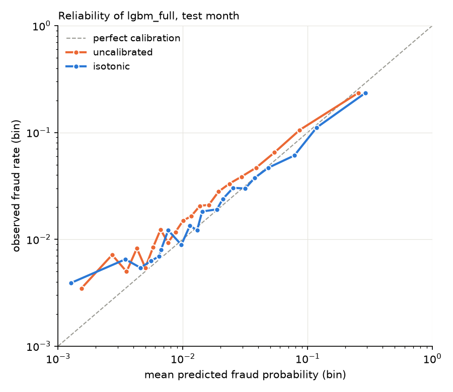

# Test month results

Test month, touched once. 92427 payments, 3.48% fraud. Thresholds marked 'valid thr.' were chosen on the validation month.

| model | ROC-AUC | PR-AUC | recall @ 1% FPR | recall @ valid thr. (FPR) | fraud $ recall @ 1% legit $ | fraud $ recall @ valid thr. (legit $) |
|---|---|---|---|---|---|---|
| rules (one operating point) | | | | 28.3% (5.72%) | | 25.8% (8.56%) |
| logreg | 0.7947 | 0.1134 | 0.5% | 15.9% (2.88%) | 0.9% | 12.7% (2.89%) |
| lgbm_raw | 0.7745 | 0.2016 | 14.8% | 15.2% (1.04%) | 15.6% | 16.0% (1.08%) |
| lgbm_full | 0.8105 | 0.2275 | 16.8% | 19.0% (1.27%) | 20.5% | 21.9% (1.14%) |

Calibration of lgbm_full (the served model):

| | Brier | ECE, 10 equal-width bins | ECE, 20 equal-count bins |
|---|---|---|---|
| uncalibrated | 0.03017 | 0.00712 | 0.00659 |
| isotonic | 0.03025 | 0.00381 | 0.00569 |

Definitions are in python/evaluate.py. 
